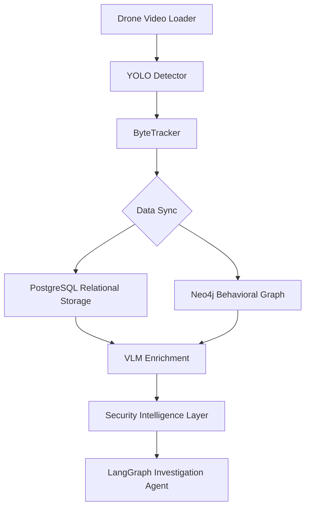

# FlytBase: Drone-Powered Security Analyst

FlytBase is a multi-modal security orchestration platform that transforms aerial drone telemetry into structured, behavioral intelligence. By combining computer vision with relational and graph knowledge bases, FlytBase provides a conversational interface for advanced security investigations.

---

## 🏛 System Design & Flow

FlytBase converts raw video pixels into semantic knowledge through a multi-stage pipeline.



### Core Architecture Highlights
- **Dual-Database Layer**: Combines the precision of SQL (Time-series) with the depth of Graph (Behavioral Context).
- **VLM Refinement**: Uses CLIP/BLIP to extract semantic attributes like color, gender, and age, making the data "human-searchable."
- **Agent Orchestration**: A memory-enabled LangGraph agent that pivots across databases to answer complex security questions.

[Read the Detailed Design & Architecture Report →](docs/architecture.md)

---

## 🤖 AI Tools Integrated

The integration of these tools fundamentally enhanced the system's accuracy and developer efficiency:
- **YOLOv8**: Real-time object classification and localization.
- **CLIP**: Visual embedding for similarity search and visual novelty detection.
- **BLIP**: Natural language captioning of surveillance scenes.
- **Ollama (Qwen2.5)**: Local LLM for on-edge reasoning and threat assessment.
- **LangGraph**: Orchestrates the logical flow between multiple tools and databases.

---

## 🚀 Setup & Installation

### 1. Prerequisites
- **Python 3.10+** (Recommended: 3.12)
- **PostgreSQL 15+** with `pgvector` extension.
- **Neo4j 5+** (Running locally or via Docker).
- **Ollama** installed and running (`qwen2.5:3b` model pulled).

### 2. Installation
```bash
# Clone the repository
git clone <repo-url>
cd FlytBase

# Create virtual environment
python -m venv .venv
source .venv/bin/activate

# Install dependencies
pip install -r requirements.txt
```

### 3. Running the System

#### Full Simulation Pipeline
Process a video source and populate the intelligence layer:
```bash
python main.py --source data/demo/video.mp4
```

#### Interactive Analyst (CLI)
Investigate the processed data through a conversational interface:
```bash
export PYTHONPATH=$PYTHONPATH:$(pwd)
python src/agent/agent.py
```

---

## ✅ Testing & Validation

The system has been validated across various high-stress scenarios:
- **ID Persistence Test**: Maintaining object identities during high-speed drone pans.
- **Threat Detection**: Successfully flagging loitering and unauthorized off-hours entry.
- **Cross-DB Sync**: Ensuring 100% data integrity between Relational and Graph stores.

[View Full Testing & Validation Report →](docs/testing.md)

---

## 📂 Project Structure
- `src/perciever`: Detection and Tracking modules. [Docs](docs/perception.md)
- `src/vlm`: visual language model integration. [Docs](docs/vlm.md)
- `src/db`: Database connectivity and schema. [Docs](docs/data_layer.md)
- `src/security`: Threat detection heuristics. [Docs](docs/security.md)
- `src/agent`: LangGraph orchestrator. [Docs](docs/agent.md)
