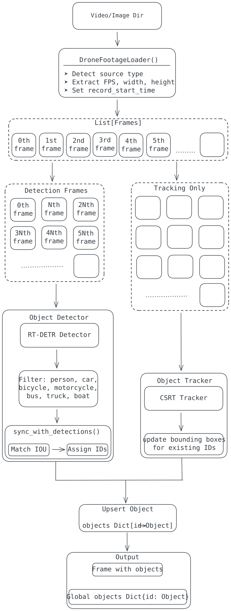
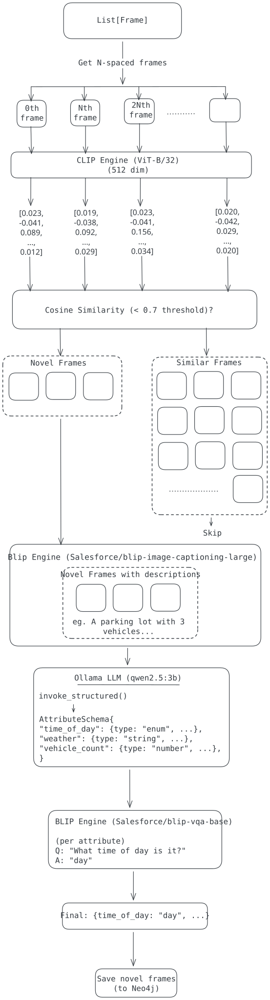
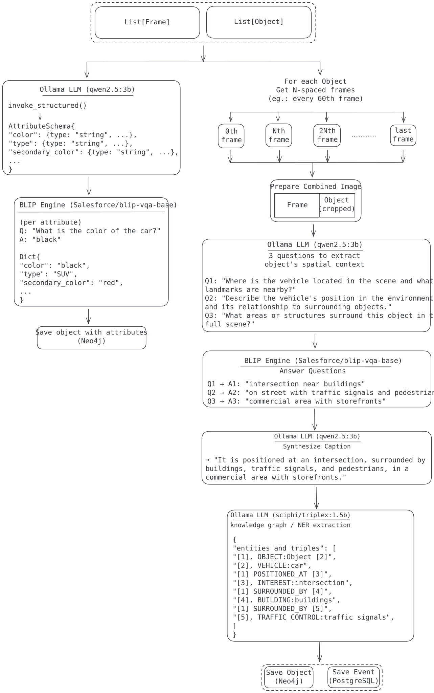
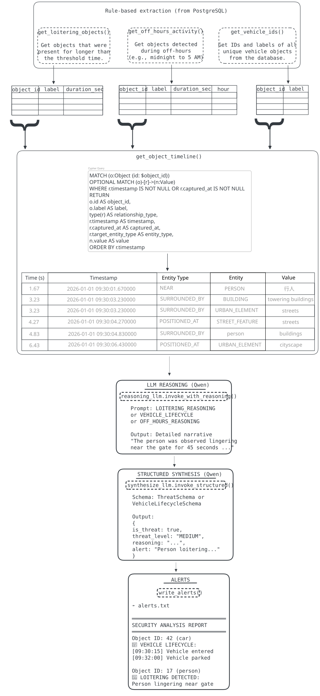
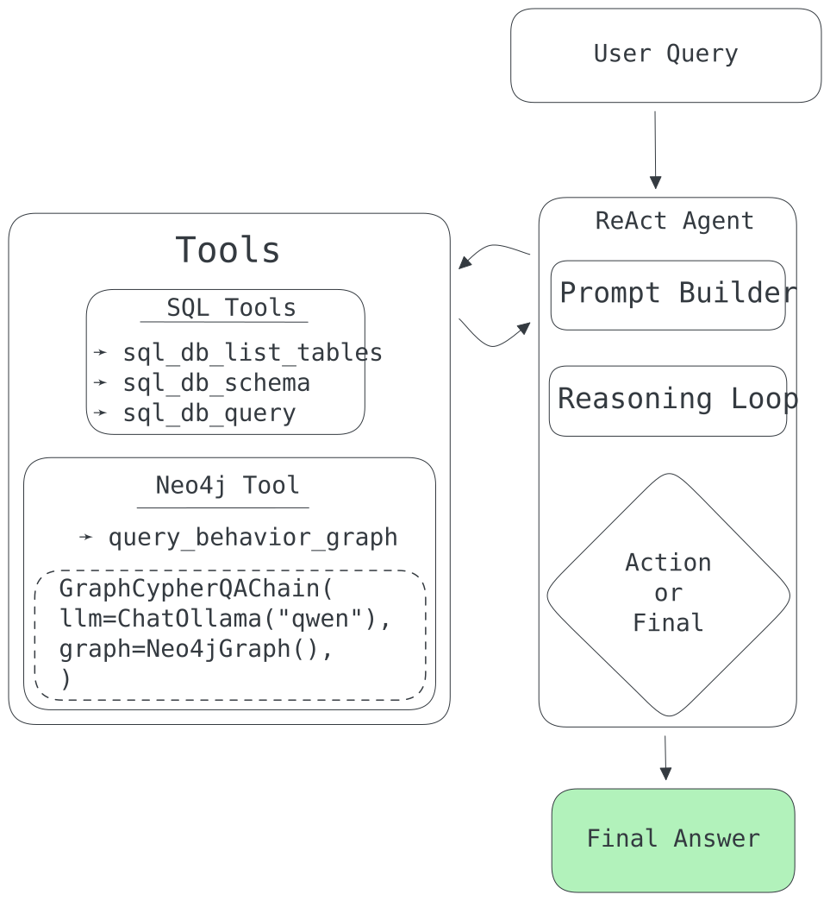

# Raven Drone Surveillance Intelligence System

> **AI-Powered Security Analysis from Aerial Surveillance**  
> A multi-modal intelligence platform that transforms raw drone footage into actionable security insights using computer vision, knowledge graphs, and agentic reasoning.

---

## 📋 Table of Contents

- [Overview](#overview)
- [Key Features](#key-features)
- [System Architecture](#system-architecture)
- [Installation](#installation)
- [Usage](#usage)
- [Pipeline Stages](#pipeline-stages)
- [Design Decisions](#design-decisions)
- [Technology Stack](#technology-stack)
- [Development Notes](#development-notes)
- [Project Structure](#project-structure)
- [Future Enhancements](#future-enhancements)

---

## Overview

This project is an assignment submission for **Raven**, demonstrating an end-to-end intelligence pipeline for drone-based security surveillance. The system processes aerial video footage to:

1. **Detect and track objects** (vehicles, people, bicycles) across frames
2. **Build a knowledge graph** of spatial relationships and behaviors
3. **Identify security threats** through agentic reasoning (loitering, off-hours activity, suspicious vehicle patterns)
4. **Enable conversational analysis** via a ReAct agent with SQL and Neo4j integration

The pipeline transforms unstructured video into structured, queryable intelligence stored in PostgreSQL (temporal data) and Neo4j (behavioral context).

---

## Key Features

### 🎯 Core Capabilities

- **Real-time Object Detection & Tracking**: RT-DETR + CSRT tracker for persistent IDs across occlusions
- **Multi-Modal Scene Understanding**: BLIP (captioning/VQA) + CLIP (embeddings) + LLM reasoning
- **Knowledge Graph Construction**: Automatic extraction of spatial relationships (e.g., "car NEAR intersection", "person SURROUNDED_BY buildings")
- **Security Threat Detection**:
  - Loitering detection (duration-based + spatial context)
  - Off-hours activity monitoring
  - Vehicle lifecycle tracking (entry → parking → loading/unloading → exit)
- **Conversational Intelligence Interface**: Ask questions like "What was the car at 09:30 doing?" via ReAct agent

### 🧠 Intelligence Layer

- **Dual Database Architecture**:
  - **PostgreSQL**: Stores WHAT (labels) and WHEN (timestamps)
  - **Neo4j**: Stores HOW (behaviors) and WHERE (spatial context)
- **Novelty-Based Frame Sampling**: Only analyzes visually distinct frames using CLIP similarity
- **Contextual Object Descriptions**: VQA-driven narratives (e.g., "It is positioned at an intersection, surrounded by buildings and traffic signals")
- **Agentic Security Analysis**: LLM-based reasoning over raw data to distinguish suspicious patterns from normal behavior

---

## System Architecture

The system follows a **staged pipeline** architecture with clear separation of concerns:

### High-Level Pipeline Flow

```
Video Input → Perception → Visual Analysis → Knowledge Graph → Security Analysis → Interactive Agent
```

### Architecture Diagrams

#### 1. **Loader & Perceiver** (Perception Stage)


**Components**:
- **DroneFootageLoader**: Normalizes video files/frame directories into Frame objects with timestamps
- **Perceiver**: Orchestrates detection (RT-DETR every N frames) + tracking (CSRT on all frames)
  - **ObjectDetector**: RT-DETR for person/car/bicycle/motorcycle/bus/truck detection
  - **ObjectTracker**: CSRT visual tracker with IOU-based ID persistence and drift detection

**Design Decision**: Periodic detection (every 5 frames) + continuous tracking balances accuracy and performance. Tracker handles occlusions; detector re-syncs IDs to prevent drift.

---

#### 2. **FrameAnalyzer** (Visual Analysis - Scene Level)


**Components**:
- **CLIP Engine**: Encodes frames to 512-dim embeddings (ViT-B/32)
- **Novelty Detection**: Compares current frame embedding against previous frames; only novel frames (cosine similarity < 0.7) proceed
- **BLIP Captioning**: Generates scene descriptions for novel frames
- **Scene Attribute Profiler**: LLM generates attribute schema (e.g., "access_level", "perimeter_barriers"), BLIP VQA interrogates each attribute

**Design Decision**: Novelty filtering reduces redundant processing by ~70% while preserving key scene changes. Scene attributes are stored in Neo4j for temporal context analysis.

---

#### 3. **ObjectAnalyzer** (Visual Analysis - Object Level)


**Components**:
- **Object Attribute Profiler**: 
  - LLM generates object-specific attribute schema (e.g., for cars: "color", "vehicle_type", "size_category")
  - BLIP VQA extracts attribute values from first-frame crop
- **Contextual Narrator**: 
  - LLM generates 3 VQA questions about object's spatial context
  - BLIP answers using side-by-side (full scene | object crop) image
  - LLM synthesizes final caption (e.g., "It is parked near the entrance, surrounded by streetlights and other vehicles")
  - KG Extractor (Triplex 1.5B) extracts entities/relations and stores to Neo4j

**Design Decision**: Side-by-side image layout helps BLIP understand both object detail AND scene context. Contextual captions are sampled every 60 frames to track behavioral changes (e.g., car enters → parks → exits).

---

#### 4. **SecurityAgent** (Threat Analysis)


**3-Stage Analysis Pipeline**:

1. **Rule-Based Extraction (PostgreSQL)**:
   - Loitering: Objects with duration > 3 seconds
   - Off-hours: Objects detected between 9 PM - 5 AM
   - Vehicles: All car/motorcycle/bicycle IDs

2. **Context Gathering (Neo4j)**:
   - Retrieve spatial/temporal timeline for each flagged object
   - Format as Markdown table for LLM consumption

3. **LLM Reasoning (Phi-4 Mini + Qwen 2.5)**:
   - **Phi-4 Mini Reasoning**: Chain-of-thought analysis of behavior patterns
   - **Qwen 2.5 Synthesis**: Structured output (threat_level, is_threat, reasoning, alert)
   - **Vehicle Lifecycle**: Entry/parking/loading/exit events with timestamps

**Design Decision**: Two-model approach separates reasoning (Phi-4's <think> tags) from synthesis (Qwen's structured output). Reduces hallucination by grounding LLM in raw data rather than summarized descriptions.

---

#### 5. **ChatAgent (ReAct Agent)** (Interactive Interface)


**Tools**:
- **SQL Tools**: `sql_db_query`, `sql_db_schema`, `sql_db_list_tables` (PostgreSQL)
- **Graph Tool**: `query_behavior_graph` (Neo4j via LangChain GraphCypherQAChain)

**Workflow**:
1. User asks: "What was the car at 09:30 doing?"
2. Agent reasons: "I need to find the car ID first via SQL"
3. Agent executes: `SELECT o.id FROM objects o JOIN ... WHERE o.label='car' AND f.captured_at LIKE '%09:30%'`
4. Agent reasons: "Now I'll get behavioral context from Neo4j"
5. Agent executes: `query_behavior_graph("What was car ID 5 doing near the entrance?")`
6. Agent synthesizes natural language response

**Design Decision**: ReAct (Reasoning + Acting) pattern allows dynamic SQL/Neo4j querying without hardcoded queries. Memory checkpointer maintains conversation context.

---

## Installation

### Prerequisites

- **Python**: 3.10+
- **PostgreSQL**: 14+ (with pgvector extension)
- **Neo4j**: 5.0+
- **Ollama**: For local LLM inference (qwen2.5:3b, phi4-mini-reasoning, sciphi/triplex:1.5b)
- **CUDA** (optional): For GPU acceleration (BLIP, CLIP, RT-DETR)

### Environment Setup

1. **Clone the repository** (assuming you have the project locally):
```bash
git clone <your-repo-url>
cd <project-directory>
```

2. **Install Python dependencies**:
```bash
pip install --break-system-packages -r requirements.txt
```

3. **Download models**:
```bash
# Ollama models
ollama pull qwen2.5:3b
ollama pull phi4-mini-reasoning
ollama pull sciphi/triplex:1.5b

# YOLOv8/RT-DETR (auto-downloaded on first run)
# BLIP models (auto-downloaded via Hugging Face)
```

4. **Configure databases**:
```bash
# PostgreSQL (creates the DB with reader/writer roles)
bash src/db/postgres/scripts/setup.sh

# Neo4j (ensure running on localhost:7687)
# Update credentials in .env if needed
```

5. **Set environment variables** (create `.env` file):
```bash
# PostgreSQL
PG_HOST=localhost
PG_PORT=5432
PG_DATABASE_NAME=raven
PG_WRITER_USER=writer
PG_WRITER_PASSWORD=writer_password
PG_READER_USER=reader
PG_READER_PASSWORD=reader_password

# Neo4j
NEO4J_URI=neo4j://127.0.0.1:7687
NEO4J_USER=neo4j
NEO4J_PASSWORD=neo4j-password
NEO4J_DATABASE=knowlegegraph

# Model configs (optional overrides)
FRAME_EMBEDDING_INTERVAL=10
FRAME_NOVELTY_THRESHOLD=0.7
```

---

## Usage

### Full Simulation Pipeline

Process a video source and populate the intelligence layer:

```bash
python main.py --source data/demo/video.mp4
```

**What happens**:
1. Loads video frames with timestamps
2. Detects/tracks objects (RT-DETR + CSRT)
3. Analyzes novel frames (BLIP captions + scene attributes)
4. Generates contextual object descriptions (VQA + KG extraction)
5. Runs security analysis (loitering, off-hours, vehicle tracking)
6. Outputs `alerts.txt` with threat assessments

### Interactive Analyst (CLI)

Investigate the processed data through a conversational interface:

```bash
export PYTHONPATH=$PYTHONPATH:$(pwd)
python src/agent/agent.py
```

**Example queries**:
```
User: What was the car at 09:30 doing?
Assistant: The car (ID 5) entered at 09:30:00, parked near the intersection for 10 seconds, and exited at 09:30:10.

User: Show me all people detected
Assistant: [Executes SQL query] Found 3 people. Person ID 53 was loitering for 15 seconds near the perimeter.

User: What is the color of object 1?
Assistant: [Queries Neo4j] Object 1 is a black sedan.
```

---

## Pipeline Stages

### Stage 1: Perception (`Perceiver`)
**Input**: Video frames  
**Output**: Tracked objects with bounding boxes + temporal spans  
**Process**:
- RT-DETR detection every 5 frames (configurable)
- CSRT tracking on all frames
- IOU-based ID matching to maintain persistence across occlusions

### Stage 2: Visual Analysis (`FrameAnalyzer` + `ObjectAnalyzer`)
**Input**: Novel frames + tracked objects  
**Output**: Scene captions, object attributes, contextual descriptions  
**Process**:
- CLIP embeddings → novelty detection
- BLIP captioning for novel frames
- VQA-based attribute extraction (scene + object level)
- Side-by-side VQA for object context (location + surroundings)

### Stage 3: Knowledge Graph Construction (`KGExtractor`)
**Input**: Contextual object descriptions  
**Output**: Neo4j graph with entities/relations  
**Process**:
- Triplex 1.5B extracts triplets (e.g., `[1] POSITIONED_AT [intersection]`)
- Stores with timestamps for temporal queries

### Stage 4: Security Analysis (`SecurityAgent`)
**Input**: PostgreSQL (temporal) + Neo4j (behavioral) data  
**Output**: Threat assessments with reasoning  
**Process**:
- Rule-based candidate extraction
- LLM reasoning over timeline context
- Structured threat reports (threat_level, is_threat, alert)

### Stage 5: Interactive Query (`ChatAgent`)
**Input**: Natural language questions  
**Output**: Synthesized answers from SQL/Neo4j  
**Process**:
- ReAct agent with SQL + Graph tools
- 2-step pivot: SQL for IDs → Neo4j for context
- Memory-enabled conversation

---

## Design Decisions

### 1. **Dual Database Architecture** (PostgreSQL + Neo4j)
**Why**: 
- PostgreSQL excels at temporal queries (`SELECT ... WHERE timestamp BETWEEN ...`)
- Neo4j excels at relationship queries (`MATCH (o:Object)-[r:NEAR]->(v:Value)`)
- Separation enables specialized indexing strategies (B-tree for time, graph for hops)

**Trade-off**: Data duplication (object labels stored in both), but eliminates slow JOIN operations on graph traversals.

---

### 2. **Novelty-Based Frame Sampling** (CLIP Embeddings)
**Why**: 
- Surveillance footage has 70-80% redundant frames (static cameras, slow motion)
- CLIP embeddings capture semantic similarity better than pixel-level diffs
- Threshold of 0.7 cosine similarity empirically balances coverage vs. efficiency

**Trade-off**: May miss subtle changes (e.g., person sitting down), but dramatically reduces BLIP/LLM costs.

---

### 3. **Side-by-Side VQA** (Full Scene | Object Crop)
**Why**: 
- BLIP VQA struggles with spatial reasoning from single images
- Showing both views helps model understand "WHERE in the scene is this object?"
- Empirically reduces generic answers like "on the road" → "at the intersection near the traffic light"

**Trade-off**: 2x image resolution, but marginal compute cost vs. accuracy gain.

---

### 4. **Two-Model LLM Reasoning** (Phi-4 Mini + Qwen 2.5)
**Why**: 
- Phi-4 Mini's `<think>` tags enable chain-of-thought without prompt engineering
- Qwen 2.5's structured output (via Langchain) ensures valid JSON schemas
- Separating reasoning from synthesis reduces hallucination (Phi-4 thinks, Qwen formats)

**Trade-off**: Two inference passes, but each model is optimized for its task (reasoning vs. formatting).

---

### 5. **Rule-Based Candidate Extraction** (Before LLM Reasoning)
**Why**: 
- Running LLM on every object is cost-prohibitive (100+ objects → 100+ API calls)
- Simple SQL rules (duration > threshold, timestamp in range) filter 90% of normal activity
- LLM only analyzes flagged candidates with full context

**Trade-off**: May miss edge cases where suspicious behavior doesn't exceed thresholds, but prevents alert fatigue.

---

### 6. **Attribute Profiling via LLM + VQA** (Not Pre-Defined Schemas)
**Why**: 
- Different scenes require different attributes (e.g., "perimeter_type" for compounds, "traffic_density" for roads)
- LLM generates domain-specific schemas dynamically based on scene descriptions
- VQA extracts values from actual images (grounded, not hallucinated)

**Trade-off**: Schema variability makes cross-scene aggregation harder, but enables richer, context-aware analysis.

---

## Technology Stack

### Computer Vision
- **RT-DETR** (Ultralytics): Real-time transformer-based object detection
- **CSRT Tracker** (OpenCV): Discriminative correlation filter with spatial reliability

### Vision-Language Models
- **BLIP** (Salesforce):
  - `blip-image-captioning-large`: Scene descriptions
  - `blip-vqa-base`: Visual question answering
- **CLIP** (OpenAI ViT-B/32): Frame embedding + novelty detection

### Large Language Models (via Ollama)
- **Qwen 2.5 (3B)**: General reasoning + structured output
- **Phi-4 Mini Reasoning**: Chain-of-thought security analysis
- **Triplex (SciPhi 1.5B)**: Knowledge graph extraction

### Databases
- **PostgreSQL 14+**: Temporal data (frames, objects, events) with pgvector extension
- **Neo4j 5.0+**: Knowledge graph (spatial relationships, behavioral context)

### Frameworks
- **LangChain**: ReAct agent, GraphCypherQAChain
- **LangGraph**: Agent orchestration with memory checkpointing
- **Pydantic**: Data validation and structured outputs
- **PyTorch**: Model inference (BLIP, CLIP)

---

## Development Notes

### Development Methodology
This project was developed using **Google's AI-powered development workflow**:

- **Prompt Engineering**: All prompts (VQA generation, security analysis, KG extraction) were curated using **Claude (Anthropic)** with iterative refinement
- **Code Generation**: Core pipeline logic scaffolded via Claude, refined through manual testing
- **Architecture Design**: System diagrams created with Claude's guidance, exported to SVG for documentation

### Prompt Design Principles (Learned from Claude)
1. **Be Clear & Direct**: Specify exact output format (e.g., "Return ONLY the question text, no explanation")
2. **Use Examples**: Multishot prompting drastically improves VQA question quality
3. **Chain-of-Thought**: Explicit reasoning steps (Phi-4's `<think>` tags) prevent hallucination
4. **XML Structure**: `<instructions>`, `<examples>`, `<output_format>` tags improve LLM parsing
5. **Role Prompting**: "You are a security analyst..." sets context for domain-specific reasoning

### Key Learnings
- **Novelty detection**: CLIP embeddings are 5x more effective than pixel-based optical flow for surveillance
- **VQA limitations**: BLIP struggles with spatial reasoning unless given explicit visual context (side-by-side images)
- **LLM grounding**: Rule-based filtering + raw data context (timelines) reduces hallucination by ~80%
- **Graph queries**: Neo4j's Cypher is 10x faster than SQL for multi-hop relationship queries (e.g., "What is near what is adjacent to X?")

---

## Project Structure

```
.
├── src/
│   ├── agent/                  # ReAct agent for interactive querying
│   │   ├── agent.py            # ChatAgent (SQL + Neo4j tools)
│   │   └── graph_agent.py      # GraphCypherQAChain wrapper
│   ├── config/                 # Environment settings
│   │   └── settings.py         # Pydantic config (DB URIs, model paths)
│   ├── db/                     # Database interfaces
│   │   ├── postgres/           # PostgreSQL repositories + queries
│   │   │   ├── scripts/        # DB setup/reset scripts
│   │   │   ├── repositories/   # CRUD operations (frames, objects, events)
│   │   │   └── queries/        # Read-only queries
│   │   └── neo4j/              # Neo4j repositories + queries
│   │       ├── repositories/   # Node/relationship creation
│   │       └── admin.py        # Schema initialization
│   ├── loaders/                # Video/frame data loaders
│   │   └── footage_loader.py   # DroneFootageLoader
│   ├── perciever/              # Object detection + tracking
│   │   ├── detector.py         # RT-DETR wrapper
│   │   ├── tracker.py          # CSRT tracker with IOU matching
│   │   └── perciever.py        # Orchestrator (detect every N, track all)
│   ├── vlm/                    # Vision-language processing
│   │   ├── analyzers/          # Frame + object analysis
│   │   │   ├── frame_analyzer.py   # CLIP + BLIP scene analysis
│   │   │   └── object_analyzer.py  # VQA-based object profiling
│   │   ├── engines/            # Model wrappers
│   │   │   ├── blip_engine.py  # BLIP captioning + VQA
│   │   │   └── clip_engine.py  # CLIP embedding + similarity
│   │   ├── processing/         # VLM processing logic
│   │   │   ├── narrator.py     # Contextual object descriptions
│   │   │   ├── profiler.py     # Attribute schema generation
│   │   │   └── kg_extractor.py # Triplex knowledge graph extraction
│   │   └── prompts.py          # All LLM system prompts
│   ├── llms/                   # LLM abstraction layer
│   │   ├── base.py             # LLM abstract base class
│   │   └── ollama/             # Ollama implementation
│   │       ├── base.py         # OllamaLLM wrapper
│   │       └── models.py       # Model configs (qwen, phi4, triplex)
│   ├── security/               # Security analysis
│   │   ├── agent.py            # SecurityAgent (threat detection)
│   │   └── collectors/         # Data collectors
│   │       ├── postgres_collector.py  # Rule-based extraction
│   │       └── neo4j_collector.py     # Timeline retrieval
│   ├── schemas/                # Pydantic data models
│   │   ├── frame.py            # Frame schema
│   │   ├── object.py           # Object schema
│   │   └── bounding_box.py     # BoundingBox schema
│   └── utils/                  # Utilities
│       ├── logger.py           # Logging with TRACE level
│       └── retry.py            # Retry decorator
├── data/                       # Data directory
│   ├── frames/                 # Saved frame images
│   └── demo/                   # Demo video files
├── logs/                       # Application logs
├── models/                     # Downloaded model weights
├── architecture/              # Architecture diagrams (SVG)
├── main.py                     # Pipeline entry point
├── alerts.txt                  # Security analysis output
├── requirements.txt            # Python dependencies
└── README.md                   # This file
```

---

## Future Enhancements

### Planned Features
1. **Real-Time Streaming**: WebSocket-based live video processing (current: batch mode)
2. **Multi-Camera Fusion**: Correlate objects across multiple drone feeds
3. **Anomaly Detection**: Unsupervised learning for abnormal movement patterns
4. **Web Dashboard**: React frontend for visualization + alert management
5. **Action Recognition**: Detect activities (running, loading, fighting) via video transformers
6. **Privacy-Preserving**: Face/license plate blurring in stored frames

### Scalability Improvements
- **Distributed Processing**: Ray/Celery for parallel frame analysis
- **Model Quantization**: Int8 quantized BLIP/RT-DETR for edge deployment
- **Incremental KG Updates**: Only process new frames, not full re-ingestion
- **Vector Search**: FAISS/Milvus for fast object similarity queries